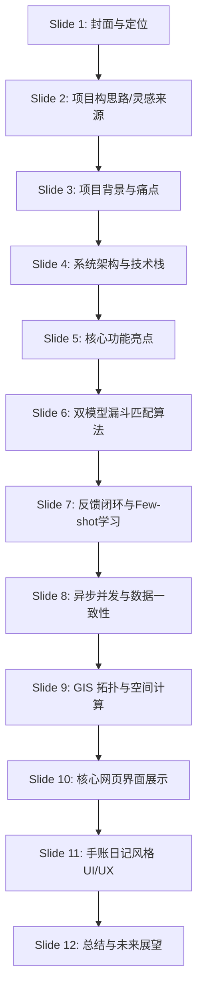

# Campus Paw-Track (校园爪迹) 项目概述与 PPT 演示指南

本篇文档是针对 **Campus Paw-Track (校园流浪动物足迹追踪系统)** 编写的系统性概述。内容经过提炼，可直接作为 **项目介绍 PPT** 的各页大纲与核心宣讲词。

---

## 💡 PPT 幻灯片大纲建议



### 🎬 Slide 1: 封面 —— 项目名称与定位
* **幻灯片标题**：Campus Paw-Track：校园流浪动物众包足迹追踪平台
* **副标题**：基于双模型协同与 GIS 的社区温情动物守护中枢
* **核心内容**：
  * 系统定位：基于校园地理信息系统（GIS）的社区众包打卡追踪平台。
  * 融合技术：高精地图 + 多大模型协同（图像理解 + 时空推理 + 自然写作）。
  * 核心精神：用科技温暖校园，用数据规范关怀。

---

### 💡 Slide 2: 项目构思路 —— 从 AI 整合到故事还原
* **幻灯片标题**：设计初衷与灵感演进：我们是如何想到这个项目的？
* **宣讲思路**：
  1. **AI 强大的整合推理能力**：当前大语言模型具备极强的时空上下文关联和逻辑推理能力，能将零散、碎片的输入转化为高密度的语义和连续的情感表达。
  2. **分散式数据的有机整合**：流浪动物在校园内的出没数据天然是“分散式”的（不同学生、在不同时间、不同地点随手拍摄并打卡）。这些零星打卡如何聚合在一起？
  3. **还原生命的故事**：我们想到了将这些无序的、碎片化的众包打卡串联起来，还原并生成每一只流浪动物有温度的、连续的第一人称“成长日记”与“轨迹地图”，让冰冷的数据还原为活生生的温情故事。
  4. **深度融合进程序流**：不将 AI 停留在外接插件层面，而是将其深度缝合进系统底层的图片上传校验、实体去重判定、足迹轨迹生成以及用户反馈修正的完整业务流中，实现“收集-过滤-比对-推理-故事生成”的自动化闭环。
  5. **未来数据的广阔拓展性**：通过前期的众包收集，系统积累的大量真实时空轨迹与体貌特征数据，能直接用以拓展更丰富的应用场景：
     * **还原电子宠物（云养宠）**：结合真实数据和 AI 行为预测，让学生实现云端互动，建立与真实生命关联的电子宠物情感联结。
     * **校园内动物科学管理**：为学校管理部门提供精准的流浪动物健康、繁殖状态（如绝育与否）与活动热力图，实现科学、人道、高效的管理与关怀。

---

### 🚨 Slide 3: 项目背景与痛点
* **幻灯片标题**：为什么需要“校园爪迹”？
* **宣讲痛点**：
  1. **定位困难**：流浪猫狗位置变动大，爱心学生难以精准寻找和投喂。
  2. **建档混乱**：缺乏唯一的实体身份标识，导致多名学生为同一只猫重复起名、重复建档，数据高度冗余。
  3. **数据污染**：传统的论坛或微信群众包容易混入花草、风景、自拍等无关垃圾照片，管理员维护成本极高。
  4. **情感流失**：生硬的数据表格或打卡记录缺乏可读性，难以引起社区学生的共鸣和持续打卡动力。

---

### 🛠️ Slide 4: 总体架构与技术栈
* **幻灯片标题**：全栈技术架构一览
* **架构层级**：
  * **前端展示层**：
    * **核心框架**：Vue 3 + TypeScript + Vite，保证响应式与类型安全。
    * **地图服务**：高德地图 JS API & `@vuemap/vue-amap` 组件库，提供毫秒级渲染。
    * **交互设计**：高毛玻璃质感（Glassmorphism） + 原生 SVG + 响应式布局（适配移动端 44px 触控法则）。
  * **后端服务层**：
    * **核心框架**：Spring Boot 3.2.5 (Java 17)，利用 Spring Data JPA 优雅处理数据持久化。
    * **大模型驱动**：**Qwen-VL-Max**（视觉识图与对比） + **DeepSeek-v4-pro**（时空推理、特征融合与情感写作）。
  * **数据存储层**：
    * **空间数据库**：MySQL 8.0，通过空间几何对象 `POINT` 及其空间索引实现高性能位置查找。

---

### 🌟 Slide 5: 核心功能亮点（用户视角）
* **幻灯片标题**：有温度的人机交互功能
* **四大核心功能**：
  1. **零负担智能打卡**：用户只需在高德地图上点击“在这发现了它”，即可在点击处渲染带有弹性动画（`bounce-marker`）的临时定位针，拍照上传后系统自动读取定位，去掉繁琐输入。
  2. **时空足迹时间轴**：按时间正序拼接特定动物的生存记录，现场照片、行为标签、文字描述一目了然，绘制其完整的校园行为轨迹。
  3. **第一人称生活成长日记**：AI 根据该动物的历史轨迹，以第一人称（如猫咪视角）自动撰写有趣、幽默的生活日记，拉近人宠情感纽带。
  4. **AI 行为预测大脑**：结合当前系统时间，分析该动物以往在类似时间段的行为规律，推理它当前最可能出没的地点（如“这会通常在食堂蹲鱼干”）。

---

### 🧠 Slide 6: 硬核技术亮点（一）：漏斗式实体去重算法 (Funnel Matching)
* **幻灯片标题**：图片上传时的“多模型漏斗式去重”
* **宣讲痛点**：如何避免重复给同一只动物建新档？
* **漏斗设计**：
  ```text
  [ 用户上传新图片 ]
          │
          ▼  (Qwen-VL-Max 初筛)
  [ 提取动物种类 (例如 Cat) 与外貌文字特征 ]
          │
          ▼  (JPA 数据库筛选)
  [ 获取数据库内所有的同种类 (Cat) 候选猫咪 ]
          │
          ▼  (DeepSeek 特征过滤 - 超过4个时触发)
  [ 基于外貌特征相似度, 筛选出相关度最高的 4 个候选 ID ]
          │
          ▼  (Qwen-VL-Max 视觉终审)
  [ 将新图(图0) 与 4个候选猫咪头像(图1~4) 像素级比对 ]
          ├─── 判定匹配成功 (例如图2为同只猫) ───► [ 自动绑定已有档案，DeepSeek 智能融合新旧身体特征 ]
          └─── 判定匹配失败 (NEW) ─────────────► [ 新建档案，系统根据数据库序列号自增分配全局唯一ID (如 Cat-6) ]
  ```
* **技术优势**：结合“文本语义过滤”与“多图视觉大模型终审”，实现极低成本的实体级别去重。

---

### 🔁 Slide 7: 硬核技术亮点（二）：基于 Few-Shot Learning 的反馈闭环
* **幻灯片标题**：行为推理与用户纠偏学习（In-Context Learning）
* **运行机制**：
  1. **AI 预测行为**：用户点击“AI 行为推理”时，系统调用 DeepSeek 推演动物当前最可能的行为。
  2. **用户反馈输入**：如果预测有偏差，用户可点击“确认修正”选择真实状态（例如实际上是 `EATING`），反馈将被存入 `prediction_feedbacks` 表中。
  3. **Few-shot 自学习**：下一次对该动物进行预测时，后端读取最近 5 次的纠偏数据，将它们拼接进 Prompt 上下文发送给大模型（如：“曾预测在睡觉，实际上用户修正为干饭”）。
* **技术优势**：无需消耗昂贵的训练成本，AI 能够通过 In-Context Learning 自动根据该动物的“个性偏好”和“历史预测失误”自适应微调推演权重。

---

### ⚡ Slide 8: 硬核技术亮点（三）：异步任务隔离与防竞态提交
* **幻灯片标题**：高并发保障：异步协程与事务同步机制
* **核心方案**：
  1. **Tomcat 线程池防阻塞**：
     * Qwen 图像识别与比对耗时 2~5 秒，为防止并发打卡时线程池被打满，后端将核心打卡写入与复杂的 AI 成长日记生成完全**解耦**。
     * 日记生成采用 `@Async` 声明在独立的后台线程池中异步运行，前端打卡能在毫秒级响应 `200 OK`，彻底解决了大模型接口挂起导致的 Web 线程雪崩隐患。
  2. **事务提交后钩子 (Transaction Synchronization)**：
     * **并发竞态风险**：若异步 AI 日记线程启动过快，可能会在主线程足迹数据还没写完（事务未提交）时就去读库，导致“脏读”或拿不到足迹。
     * **解决方案**：引入 `TransactionSynchronizationManager.registerSynchronization`，确保主线程的数据库事务**完全 Commit 成功后**，才正式触发异步 AI 生成协程。保证了多线程状态下的绝对数据一致性。

---

### 🌐 Slide 9: 硬核技术亮点（四）：高性能 GIS 与空间数据结构
* **幻灯片标题**：基于空间数据类型（POINT）的高性能地理拓扑
* **核心内容**：
  * **底层存储**：使用 MySQL 8.0 空间拓扑对象 `POINT` 存储经纬度，代替传统的两个 `double` 字段。
  * **空间索引 (SPATIAL INDEX)**：利用 R-Tree 索引对地理坐标点进行加速，大幅提升了“拉取全图打卡点”以及“计算两点间米级几何距离”的查询性能。
  * **JPA 实体映射**：在 Java 中，采用 `@Formula` 注解实时动态调用 MySQL 空间函数 `ST_Latitude(geom)` 与 `ST_Longitude(geom)`，免除了在应用层做空间转换的繁琐步骤，提升系统效率。

---

### 💻 Slide 10: 核心网页界面展示 (系统模块全景)
* **幻灯片标题**：系统模块展示：将科技化作视觉交互
* *(本页建议在 PPT 中贴入系统实际截图，配合以下文本宣讲)*
* **展示模块**：
  1. **主页与 GIS 全景地图**：
     * 界面展示高精度的校园地图底座。
     * 亮点：实时 GPS 定位波纹特效、分布在各处的动物专属头像锚点图标（点击可查看详情）。
  2. **“在这发现了它”打卡表单**：
     * 展示用户二次点击地图后弹出的录入表单。
     * 亮点：悬浮的玻璃拟态（Glassmorphism）面板，极简的照片上传与特征勾选界面，无二维码或繁琐 ID 输入。
  3. **底部图鉴网格与时空轨迹线**：
     * 展示屏幕底部的动物图鉴划拉条与动物详情。
     * 亮点：点击图鉴卡片调出的精美“时空轨迹时间轴”，按时间节点串联历史打卡照片与行为状态。
  4. **AI 推理大脑与手账日记便签**：
     * 展示 AI 交互界面。
     * 亮点：拟真的物理纸质手写便签呈现小动物的成长故事；推理模态框提供“准确认同”与“手动修正”反馈按钮。
  5. **超级管理员控制台 (Admin Dashboard)**：
     * 展示后端治理入口（供校方或社团使用）。
     * 亮点：动物档案集中管控、异常打卡快速清理与违规图片拦截记录。

---

### 🎨 Slide 11: 极致 UI/UX 设计美学
* **幻灯片标题**：手账本物理质感与防错设计（Kaizen & Poka-Yoke）
* **美学要素**：
  * **手账式物理风格**：高透毛玻璃卡片、拍立得相纸实拍墙、手写风字体便签，让流浪动物记录像翻阅日记本一样温暖细腻，大大提高用户黏性。
  * **动态视觉微交互**：用户定位点周围附带 CSS 脉冲波纹动画（`pulse-ring`），行为打卡节点采用不同色彩的徽章设计。
  * **移动端触控友好**：严格遵守 **44x44px 黄金物理响应区域** 规范，将小屏幕上的选择器和按钮全部拓宽，降低单手操作误触率。
  * **Poka-Yoke 防错**：表单采用前端非阻塞校验，提交按钮置灰，避免使用粗暴的原生 `alert` 弹窗，维护丝滑的交互心智。

---

### 🚀 Slide 12: 总结与未来展望 —— 数据资产赋能，实现云端共生
* **幻灯片标题**：数据赋能，传递温暖
* **未来升级与场景拓展**：
  1. **还原“真实数据关联”的电子宠物系统**：利用众包积累的真实运动轨迹、身体数据和行为惯性，将实体宠物转化为手机中的虚拟陪伴电子宠物。用户可足不出户进行“云喂养”、“虚拟交互”，并从 AI 处获取其健康与行为动态，增强趣味与用户留存。
  2. **校园流浪动物的科学精细化管理**：通过分析轨迹热力图与出没频次，协助校园管理部门制定精细化的流浪动物 TNR（捕捉、绝育、释放）计划，监控繁衍速度、疫苗注射率及群体健康状态，提供数字化治理工具。
  3. **架构升级与高并发支持**：
     * **Token 去状态化**：引入 JWT 替代本地内存 Token 存储，配合 Nginx 实现无缝的多机集群部署。
     * **分布式缓存与原子序列**：利用 Redis 缓存跨节点共享登录状态；在游客首次访问时使用 Redis 的 `INCR` 保证游客昵称生成的绝对唯一性，防止并发重复。
     * **轻量化消息队列**：在高频大打卡流量下，引入 RabbitMQ 异步队列消峰，保障系统的极致高吞吐。
